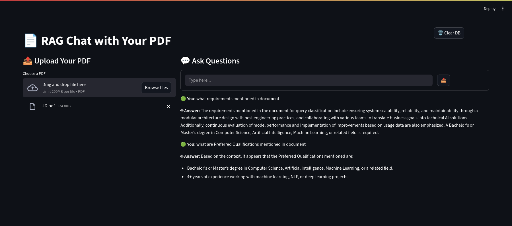

# 📄 PDF Chat App using RAG (Retrieval-Augmented Generation)

A simple Streamlit-based app that lets you **chat with your PDF files** using a **local open-source LLM** powered by [Ollama](https://ollama.com). It utilizes **Retrieval-Augmented Generation (RAG)** to extract and respond based on the content of your documents — all offline.

---
## 🖥️ GUI

## ⚙️ Installation & Setup

Follow these steps to set up the app locally:

### 1. Create a Virtual Environment (Recommended)

```bash
python -m venv venv
source venv/bin/activate        # On Windows: venv\Scripts\activate
````

### 2. Install Python Dependencies

```bash
pip install -r requirements.txt
```

### 3. Install and Configure Ollama

* Download and install Ollama for your OS: [https://ollama.com/download](https://ollama.com/download)
* Pull the required LLM model:

```bash
ollama pull llama3.2:1b
```

### 4. Run the App

```bash
streamlit run app.py
```

---

## 🚀 Features

* ✅ Fully offline LLM-based PDF question answering
* ✅ Uses local LLM (e.g., `llama3.2:1b`) via Ollama
* ✅ Simple and clean Streamlit UI

---

## 📌 Notes

* Tested on **CPU-only** systems
* Designed for **offline use** (no internet needed after setup)
* Current model: `llama3.2:1b` — a lightweight local model with relatively slower inference

---

## 🧠 Future Improvements

The app works well as a prototype but can be improved in the following ways:

* 💄 **UI Enhancements**: Improve the look and feel of the Streamlit interface
* 🧹 **Auto Clear Database**: Automatically clean up embeddings or cached files when the app closes
* ⚡ **Embedding Optimization**: Skip re-generating embeddings if they already exist for the uploaded file
* 📁 **Multi-file Support**: Enable chatting across multiple PDFs simultaneously
* 🚀 **Model Upgrade**: Use a faster/better LLM (e.g., larger model or one running on GPU)
* 🔒 **Security & File Management**: Add session-based cleanup and user-level file management

---

Feel free to fork, improve, or adapt this project for your own use cases!